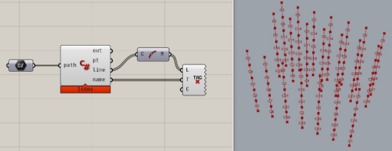

ここでは節点と部材の接続情報を取得して、Rhino 上にラインを書き出す方法について紹介します。

## ST-Bridge のデータの構造について

初めに、どこに情報があるか探しやすくするために、ST-Bridge のデータ構造について簡単に説明します。
基本的なイメージとしては一貫構造計算ソフトに近いものと考えていただくのが早いと思います。

モデルの位置、断面情報は、`StbModel` に含まれ、以下のような構成になっています。
部材の情報を取得したければ `StbMember`、断面の情報を取得したければ `StbSections` を使用する形になります。

```
ST_BRIDGE
└───StbModel
    ├───StbAxes
    ├───StbJoints
    ├───StbMembers
    ├───StbNodes
    ├───StbSections
    └───StbStories
```

各データ間の参照は id によって行っています。  
例えば`柱 A` は`節点 1-2` 間を繋ぎ、`断面番号 5` の断面を持つといった形で StbMember はデータを保持しています。
ですので、柱 A の節点座標を知りたければ、 StbNodes の id が 1 と 2 のものを探すことになります。

## 節点情報の取得

部材を構成する最も基本的な要素である節点の一覧を取得します。
節点情報は以下で取得できます。

```cs
// model は v202.ST_BRIDGE 型のインスタンス
StbNode[] nodes = model.StbModel.StbNodes;
```

配列で [StbNode](https://hiron.dev/STBDotNet/docs/STBDotNet.v202.StbNode.html) が取得できます。

StbNode は節点の id や座標情報を持つクラスになっています。
仕様上は配列のインデックスと StbNode がもつ id は一致することを強制していないので、部材の節点を参照する際は必ず id を使って参照してください。
id が "1" の節点情報を取得する際は、例えば Linq を使うと以下のように書くことができます。

```cs {1,4}
// using System.Linq をあらかじめしてください。
// model は v202.ST_BRIDGE 型のインスタンス
StbNode[] nodes = model.StbModel.StbNodes;
StbNode node1 = nodes.FirstOrDefault(n => n.id == "1");
```

id は数字で与えられている場合が多いですが、データの形式は文字列になっていますので注意してください。

### Point3d での図化

Rhino の Point3d として可視化したい場合は以下のように取得した節点情報から Point3d の配列を作成することで可能です。

```cs {4}
// using System.Linq をあらかじめしてください。
// model は v202.ST_BRIDGE 型のインスタンス
StbNode[] nodes = model.StbModel.StbNodes;
Point3d[] pts = nodes.Select(n => new Point3d(n.x, n.y, n.z)).ToArray();
```

節点の一覧が取得できたので、次に部材情報を取得します。

## 部材情報の取得

ここでは例として柱の情報を取得する方法について紹介します。
柱の情報は `StbColumn` にあるので、その値を取得します。

```cs
// model は v202.ST_BRIDGE 型のインスタンス
StbColumn[] columns = model.StbModel.StbColumns;
```

`StbColumn` はどんな値を持つかは、仕様説明書、または以下の STBDotNet のドキュメントを参照してください。

- [StbColumn ドキュメントページ](https://hiron.dev/STBDotNet/docs/STBDotNet.v202.StbColumn.html)

### Line での図化

構成する節点は、中間節点がない場合は、`id_node_bottom` と `id_node_top` の 2 つになります。
この 2 つから得られた id を取得し、前節と同様に節点の id 情報から、節点座標が取得できます。

部材の始点と終点が取得出来たら、それらを使用し部材の Line を作成することができます。

```cs
// model は v202.ST_BRIDGE 型のインスタンス
StbNode[] nodes = model.StbModel.StbNodes;
StbColumn[] columns = model.StbModel.StbMembers.StbColumns;

var pts = new Point3d[columns.length, 2];

foreach ((StbColumn column, int i) in columns.Select((column, index) => (column, index)))
{
    // 節点の箇所と同様に、節点の id と column の id が一致する StbNode のデータを取得する。
    StbNode nodeStart = nodes.FirstOrDefault(n => n.id == column.id_node_bottom);
    StbNode nodeEnd = nodes.FirstOrDefault(n => n.id == column.id_node_top);

    // 0 列目に始点、1 列目に終点を入れる
    pts[i, 0] = new Point3d(nodeStart.X, nodeStart.Y, nodeStart.Z);
    pts[i, 1] = new Point3d(nodeEnd.X, nodeEnd.Y, nodeEnd.Z);

    // Line の作成
    lines[i] = new Line(pts[i, 0], pts[i, 1]);
}
```

なおより正確に部材を描画したい場合は、例えば StbColumn には offset のプロパティが含まれますので、それを端部の節点座標に反映することで柱のオフセットを考慮することができます。

### 部材断面情報の取得

部材の符号は `name` のプロパティから取得できます。
name は書き出すソフトによりますが、2C1 のような 階 + 符号 で表される名前になります。

断面形状の情報は `id_section` のプロパティから取得できます。
節点の場合と同様に、実際の断面情報を持つ `StbSections` の中での id を表す文字列になります。

これらは上記の節点の場合と同様に以下のように取得できます。

```cs
var names = new string[columns.Length];
var idSection = new string[columns.Length];

foreach ((StbColumn column, int i) in columns.Select((column, index) => (column, index)))
{
    names[i] = column.name;
    idSection[i] = column.id_section;
}
```

断面情報は以下のような構成になっています。
省略していますが、各部分の構造種別ごとに断面情報が保持されています。

```
ST_BRIDGE
└───StbSections
    ├───StbSecColumn_RC
    ├───StbSecColumn_S
    ├───StbSecColumn_SRC
    ├───StbSecColumn_CFT
    ├───StbSecBeam_RC
    ├───StbSecBeam_S
    ├───StbSecBeam_SRC
    ├───StbSecBrace_S
    ├───StbSecSteel
    ほかいろいろ
```

`id_section` で取得する id は `StbSections` の中でユニークの値になっています。なので各クラスの中に該当する id が存在するかそれぞれに対して確認していく必要があります。

柱の場合は以下のようになります。

```cs
var sectionNames = new string[columns.Length];
StbSections sections = model.StbModel.StbSections;

foreach ((string id, int i) in idSection.Select((id, index) => (id, index)))
{
    var hasName = false;

    // RC 断面に該当す id があるか確認
    if (sections.StbSecColumn_RC != null)
    {
        foreach (StbSecColumn_RC columnRc in sections.StbSecColumn_RC)
        {
            if (columnRc.id != id) continue;
            sectionNames[i] = columnRc.name;
            hasName = true;
            break;
        }
    }

    // S 断面に該当す id があるか確認
    if (sections.StbSecColumn_S != null && !hasName)
    {
        foreach (StbSecColumn_S columnS in sections.StbSecColumn_S)
        {
            if (columnS.id != id) continue;
            sectionNames[i] = columnS.name;
            break;
        }
    }
    // 必要に応じて SRC や CFT の部分も書いてください。
}
```

id がどこに該当するかは調べるまでわからないので、上記のように 1 つ 1 つ確認していく必要があります。

今回は使用していませんが、構造種別は `StbColumn` の中の `kind_structure` で取得することができますので、StbSecColum_XX の XX の部分の構造種別がどれかは判別して調べることができます。

## C# Script コンポーネント化

これまでのことを踏まえて Grasshopper で動作するラインにタグ付けできるコンポーネントを作成します。

タグ付け自体は TextTag コンポーネントを使うとして、タグとなる文字列とそれを付ける Line を出力する C# Script コンポーネントを書いていきます。

コンポーネントの中身は以下のようにしてください。これまで書いてきた内容をベースに作成しています。

```cs title=C#Script_Component
using System.Linq;
using STBDotNet.Serialization;
using STBDotNet.v202;
using Version = STBDotNet.Enums.Version;

public class Script_Instance: GH_ScriptInstance
{
    private void RunScript(string path, ref object pt, ref object line, ref object name)
    {
        var model = Serializer.Deserialize(path, Version.Stb202) as ST_BRIDGE;

        StbNode[] nodes = model.StbModel.StbNodes;
        StbColumn[] columns = model.StbModel.StbMembers.StbColumns;

        var pts = new Point3d[columns.Length, 2];
        var lines = new Line[columns.Length];
        var idSection = new string[columns.Length];
        var sectionNames = new string[columns.Length];

        for (var i = 0; i < columns.Length; i++)
        {
            StbNode nodeStart = nodes.FirstOrDefault(n => n.id == columns[i].id_node_bottom);
            StbNode nodeEnd = nodes.FirstOrDefault(n => n.id == columns[i].id_node_top);

            pts[i, 0] = new Point3d(nodeStart.X, nodeStart.Y, nodeStart.Z);
            pts[i, 1] = new Point3d(nodeEnd.X, nodeEnd.Y, nodeEnd.Z);
            lines[i] = new Line(pts[i, 0], pts[i, 1]);

            idSection[i] = columns[i].id_section;
        }

        StbSections sections = model.StbModel.StbSections;

        for (var i = 0; i < idSection.Length; i++)
        {
            var hasName = false;

            if (sections.StbSecColumn_RC != null)
            {
                foreach (StbSecColumn_RC columnRc in sections.StbSecColumn_RC)
                {
                if (columnRc.id != idSection[i]) continue;
                sectionNames[i] = columnRc.name;
                hasName = true;
                break;
                }
            }

            if (sections.StbSecColumn_S != null && !hasName)
            {
                foreach (StbSecColumn_S columnS in sections.StbSecColumn_S)
                {
                if (columnS.id != idSection[i]) continue;
                sectionNames[i] = columnS.name;
                break;
                }
            }
        }

        pt = pts;
        line = lines;
        name = sectionNames;
    }
}
```

作成した結果を以下に示します。図化しているのは HoaryFox の Sample フォルダ内にあるデータを使用しています。

タグ付けする位置は CurveMiddle コンポーネントを使って各Lineの中点を取得しその点に対して TextTag でタグを割り当てています。


