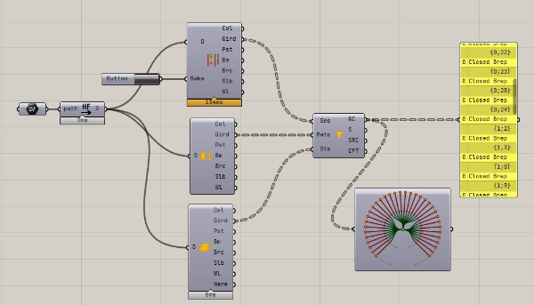

This section explains how to load the ST-Bridge model into Grasshopper and run the LCA analysis. Please refer to the model Filter2LCA.gh in the Samples folder.

In this example, the LCA analysis itself is done using a component called [Cardinal LCA](https://www.food4rhino.com/en/app/cardinal-lca), so please install it if necessary.

:::important
Please note that this function is experimental.
:::

## What is LCA Analysis?

Quote from [Wikipedia](https://ja.wikipedia.org/wiki/%E3%83%A9%E3%82%A4%E3%83%95%E3%82%B5%E3%82%A4%E3%82%AF%E3%83%AB%E3%82%A2%E3%82%BB%E3%82%B9%E3%83%A1%E3%83%B3%E3%83%88) 

> Life cycle assessment or LCA (also known as life cycle analysis) is a methodology for assessing environmental impacts associated with all the stages of the life cycle of a commercial product, process, or service. For instance, in the case of a manufactured product, environmental impacts are assessed from raw material extraction and processing (cradle), through the product's manufacture, distribution and use, to the recycling or final disposal of the materials composing it (grave).

## About Cardinal LCA

The official site is below.
Please note that we are using this component as an example only, and this site does not guarantee results or recommend its use.
- [Cardinal LCA](https://www.cardinallca.com/#)

For more information on how to use it, please refer to the demo file available at Food4Rhino.
The basic usage is to input the volume of the material you want to calculate and the material parameters required for LCA analysis, and the calculation results will be output for each material.

Material information is included by default, but since the material information is for Europe and the United States, it is necessary to set the material information necessary for LCA analysis at the target construction site by referring to the materials of the Architectural Institute of Japan mentioned above, for example.

Translated with www.DeepL.com/Translator (free version)

## Load the STB file

When you open the file, it should look like this: Right-click on the path component and select Select one existing file, then select the stb file you want to visualize.  
If there are no errors in loading, the Load STB data component next to it will convert the data. Connect this output to the visualization components to visualize the information in the Rhino viewport.

Run the LCA analysis using the Brep volume converted here.

:::important
The ST-Bridge data contains the shape and cross-sectional information of the member, but not the volume, so we use Rhino's functions to calculate the Brep volume.
For example, there may be overlapping Brep in slab-beam members and joints, but we do not subtract the overlap.  
Please check the accuracy of the volumes before use.
:::

## Filtering geometry

Since the Stb to Brep component does not output a classification by material, we will use the Filter by materials component to filter the brep by material.

By using the Material Type and Story components, the material and floor information of the member is output in a way that matches the tree structure of the brep, and this information can be input to the Filter to classify it.
The result of the filter is output in a tree structure as shown below.  

Each branch corresponds to a floor, e.g. {0;1} represents a member of the first floor, {1;25} represents a member of the second floor.
The input of the third Story(Sts) in the Filter is optional, and if there is no Story input, all the components will belong to the 0 branch.

By using this component, we can get the Brep classified by material.

## Setting material for analyze

Enter the filtered brep into the BrepImport component of the Cardinal LCA.
Give the Name an appropriate name. This will be the material name.

The material uses the value in the EC3 database attached to the Cardinal LCA, but you can set an appropriate value if necessary.

## Visualize result

By inputting the ReportInfo created for each material together into the Report component, the data is summarized and graphed.

